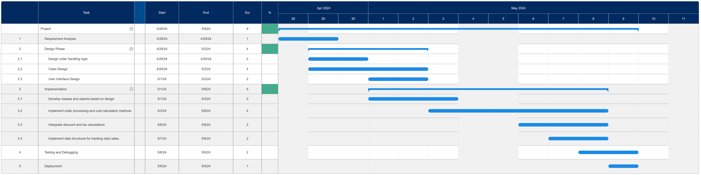

# Task 1 Project


Development Steps and Timeline for PapaPizza Ordering System:

1. Requirement Analysis (2 days):
   - Interpret requirements from PapaPizza task-sheet
   - Define functional and non-functional requirements
   - Create requirements documentation
2. Design Phase (4 days):
   1. Order handling logic
      - pseudocode
   2. Class Design
      - Create a method for PizzaOrder to store order details
      - Implement inheritance for different internal services
      - Design a class for OrderProcessor to handle order processing
   3. User Interface Design
      - Design UI for order placement and tracking
      - Develop a user-friendly interface for easy order entry

3. Implementation (6 days):
   - Develop classes and objects based on the design
   - Implement order processing and cost calculation methods
   - Integrate discount and surcharge calculations
   - Implement data structures for tracking daily sales

4. Testing and Debugging (2 weeks):
   - Conduct unit testing for individual components
   - Perform integration testing for the entire system
   - Debug any issues and ensure the system functions correctly

5. Deployment (1 week):
   - Deploy the PapaPizza Ordering System to the local Italian pizza shop
   - Ensure system stability and performance in a live environment

Gantt Chart:



Requirement Analysis
---
### Investigate

#### Problem Outline:

The purpose of the PapaPizza Ordering System is to provide a simple software solution for PapaPizza. The system aims to streamline the process of receiving and processing pizza orders, calculating costs accurately, tracking daily metrics, and applying discounts and surcharges as needed.

Objectives:
- Develop a python application that can receive and process pizza orders.
- Calculate the cost of each pizza order, considering discounts and surcharges.
- Keep track of the daily cumulative totals of each pizza variety sold.
- Apply specific discounts and surcharges for orders exceeding $100, loyalty card members, and home deliveries and tax.
- Ensure the system is user-friendly, and efficient.

#### Problem Description

Method for Calculating Cost:
1. Determine the total cost of each pizza order based on the selected pizza variety, size, and additional toppings.
2. Add a delivery fee of $8.00 for home delivery orders.
3. Provide a 5% discount for orders exceeding $100 and another 5% for members with a valid membership number.
4. Apply a 10% Goods and Services Tax (GST) on the amount after discounts and surcharges.

Process for Tracking Orders and Daily Sales:
- Maintain a record of all pizza orders received, including details such as pizza variety, subtotals, deals, totals, delivery, membership status and time.
- Summarize the quantities sold for each pizza variety with cumulative totals on a daily basis.
- Generate daily sales reports.

Features:
- Loyalty member program.
- Full order history, able to trace orders from January 1, 1970 (midnight UTC/GMT)

#### Requirements List

1. Functional Requirements:
   - Order Placement:
     - [x] Customers should be able to place pizza orders through a web interface.
     - [x] The system should allow customers to select pizza varieties and in different quantities.
     - [x] Customers should be able to specify delivery or pickup options.

   - Cost Calculation:
     - [x] The system should calculate the cost of each pizza order based on the selected options.
     - [x] Apply discounts for orders exceeding $100 or made by members.
     - [x] Apply a delivery fee of $8.00 for home delivery orders.
      
   - Sales Tracking:
     - [x] Track the quantity of each pizza variety sold daily.
     - [x] Provide a daily summary report of the total sales.

2. Non-Functional Requirements:
    - Usability:
      - [x] The web interface should be intuitive and user-friendly for customers to place orders easily.
      - [x] The system should provide clear feedback on order confirmation.

   -  Performance:
      - [x] The system should be efficient and responsive to handle multiple customer orders simultaneously.
      - [x] Ensure quick processing and calculation of order costs to reduce customer waiting time.

   - Security:
      - [x] Implement secure ciphered communicate to protect the customers unethical pizza choices.
      - [x] Ensure data protection for customer details and order information.
      - [x] Limit admin console access
      - [x] Implement secure communication protocols to protect data transmission.

Design Phase
---

#### To track daily sales metrics, my program will store all orders in a list and add up the day's orders to calculate the quantity sold for each pizza variety.

### Processing Orders

#### Method Description:
The `process_order()` function described below is responsible for processing an incoming order based on the raw query values received from the web interface. It performs calculations to determine the total cost of the order, including any discounts, delivery charges, and taxes. After processing, it creates a record of the order with detailed information and saves it for future reference.

#### Pseudocode:
```plaintext
membership_numbers = [87989, 87998,...]
pizzas = {
    "Pepperoni": 21.00,
    "Chicken Supreme": 23.50,
    ...
}
    

function process_order():
    initialize member to None
    initialize delivery to False
    initialize subtotal to 0.00

    input(membernum) -> int
    input(delivery) -> boolean
    input(order) -> dict
    
    
    if membernum is in membership_numbers:
        member = membernum
            
    for each key, value in order:
        subtotal += (pizzas(key) * value)  # value is the number of pizzas and pizzas(key) would retrieve the price

    total , discount = adjust_price_quotient(delivery, member, subtotal)

    create record:
    |   - member: member
    |   - order: order
    |   - delivery: delivery
    |   - subtotal: subtotal
    |   - discount: discount
    |   - total: total
    |_  - time: current timestamp

    add record to records list
    
function adjust_price_quotient(delivery, member, subtotal):
    initialize final to subtotal
    initialize quotient to 1.00

    if delivery is true:
        final += 8

    if member is in members list:
        # reduce quotient by 0.05 (5%) for membership discount
        quotient -= 0.05

    if sub_total is greater than 100:
        # reduce quotient by 0.05 (5%) for order total over $100
        quotient -= 0.05

    final *= quotient
    total = sub_total * 1.1  # Apply 10% tax to final price

    return total, quotient  # quotient becomes the discount.


call process_order()

```

#### Mechanics and Behaviors:
1. **Processing Order Items**:
   - For each key-value pair in the `order` dictionary input:
     - Calculate the subtotal by multiplying the quantity of each item with its respective cost obtained from the `pizzas` dictionary.

2. **Adjusting Price Quotient**:
   - Calculate the final price of the order with adjustments for delivery, membership discount, and subtotal exceeding $100.
   - The `adjust_price_quotient()` function returns the final price and a price quotient used for discount calculation.

3. **Creating Order Record**:
   - Compile order details into a record object with:
     - `member`: Member ID if provided and exists in the `members` list.
     - `order`: Dictionary of items and quantities ordered.
     - `delivery`: Boolean indicating if delivery is requested.
     - `subtotal`: Total cost of ordered items before discounts.
     - `discount`: Amount saved as a discount.
     - `total`: Final price including tax.
     - `time`: Current timestamp when the order was processed.

4. **Saving Order Record**:
   - Add the created record to the `records` list.
   - Serialize and save the updated records list to the `order_logs.json` file for future reference.

5. **Order Processing**:
   - The function efficiently handles order details, calculates pricing, applies discounts, records the transaction, and persists the data for historical tracking.

This process ensures accurate processing of orders, thorough documentation of transactions, and seamless integration of order details into the system for further analysis and management.

### Calculating Metrics

#### Method Description:
The `get_daily_total()` and related functions in the context of the main system are responsible for calculating various metrics and daily totals related to pizza orders. These metrics include total revenue, number of deliveries, taxes collected, and detailed information on pizza types ordered and their associated totals.

#### Pseudocode:
Let's use the following list to represent `records`
```plaintext
[
    record:
    |   - member: None
    |   - order: {
    |       "Pepperoni": 16,
    |       "Chicken Supreme": 3,
    |       ...
    |     },
    |   - delivery: True
    |   - subtotal: 406.50
    |   - discount: 0.05
    |   - total: 433.15
    |_  - time: 171501318

    record:
    |   - member: 87998
    |   - order: {
    |       "Pepperoni": 16,
    |       "Chicken Supreme": 3,
    |       ...
    |     },
    |   - delivery: True
    |   - subtotal: 211.50
    |   - discount: 0.1
    |   - total: 217.30
    |_  - time: 171501332
    ...
]
```

```plaintext
membership_numbers = [87989, 87998,...]
pizzas = {
    "Pepperoni": 21.00,
    "Chicken Supreme": 23.50,
    ...
}
function get_daily_total():
    initialize monetary_total to 0
    initialize deliveries_total to 0
    initialize taxes_total to 0

    for each record in records:
        if is_today(record["time"]):
            add record["subtotal"] times by record["discount"] to monetary_total
            if record["delivery"]:
                increment the deliveries_total
                increment the monetary_total by 8
    
    taxes_total = monetary_total * 0.1  # Calculate taxes based on total profit

    return monetary_total, deliveries_total, taxes_total


function get_pizza_total_daily(get):
    initialize pizza to get
    initialize count to 0

    for each record in records:
        if is_today(record[time]):
            increment count by record["order"][pizza]

    return count, count * pizzas[pizza]  # Total count and profit from the pizza type

    
function is_today(epoch):
    """Determines if a given epoch is in the same day"""
    Not Implemented
    
call get_daily_total()
get_pizza_total_daily("pepperoni")
```

#### Mechanics and Behaviors:
1. **Daily Total Calculation**:
   - Use the `is_today()` function to determine if an order was made today.
   - Accumulate the total revenue (subtotals), keep track of deliveries, and calculate taxes for all orders made on the current day.

2. **Pizza Totals Calculation**:
   - Iterate through the product menu to find the price of each pizza.
   - Count the number of pizzas ordered and calculate the total profit for each pizza type made today.

3. **Creating Pizza Totals List**:
   - Prepare an HTML list string containing information on each pizza type, the total count of pizzas ordered, and the associated profit.

### Structure Chart for Processing Orders
```text
process_order                                    --->-- adjust_price_quotient                                 
|                                                |      |                                                     
|-- Initiate member                              |      |-- Initiate subtotal from subtotal                   
|                                                |      |                                                    
|-- Initiate delivery                            |      |-- Initiate quotient to 1.00                        
|                                                |      |                                                    
|-- Initiate subtotal                            |      |-- add 8 to subtotal if delivery                    
|                                                |      |                                                    
|-- Input Member Number to membernum             |      |-- subtract 5% from quotient if member is valid     
|                                                |      |                                                    
|-- Input Delivery Bool to delivery              |      |-- subtract 5% from quotient of order price > 100   
|                                                |      |                                                    
|-- Input Order Dictionary to order              |      |-- set subtotal to itself times by the quotient     
|                                                |      |                                                    
|-- if membernum is a member                     |      |-- return subtotal *1.1 and the quotient            
|   |                                            |                                                           
|   |-- member = membernum                       |                                                           
|                                                |                                                           
|-- for each pizza in order <---<---<---<---<-   |                                                           
|   |                                        |   |                                                           
|   |-- add pizza count * price to subtotal >|   |                                                           
|                                                |                                                           
|-- get total and discount from adjust_price_quotient                                                        
|                                                                                                            
|-- create a record:                                                                                         
     member                                                                                                  
     order                                                                                                   
     delivery                                                                                                
     subtotal                                                                                                
     discount                                                                                                
     total                                                                                                   
     current timestamp                                                                                       

```

### Structure Chart for Calculating Metrics

```text
get_daily_total                                     is_today()
|                                                     |
|-- Initiate monetary_total                           |
|                                                     |
|-- Initiate deliveries_total                         |
|                                                     |
|-- Initiate taxes_total      ------------------------|
|                             |                       |
|-- orders List               |                       |
|   |                         |                       |
|   |-- for order in orders <-|-<---<---<--           |
|       |                     |           |           |
|       |-- if is_today(order)|           |           |
|           |                             |           |
|           |-- True: add order totals    |           |
|           |   |                         |           |
|           |   |-- add order to totals   |           |
|           |   |                         |           |
|           |   |---->--->--->--->--->--->|           |
|           |                             |           |
|           |-- False --->--->--->--->--->|           |
|                                                     |
|-- return totals                                     |
                                                      |
get_pizza_total_daily                                 |
|                                                     |
|-- Initiate pizza            ------------------------|
|                             |
|-- Initiate count            |
|                             |
|-- orders List               |
|   |                         |
|   |-- for order in {input} <|--<---<---<---<---<----
|       |-- if is_today(order)|                      |
|           |                                        |
|           |-- True:                                |
|           |   |                                    |
|           |   |--add order[pizza] value to count   |
|           |   |                                    |
|           |   |--->--->--->--->--->--->--->--->--->|
|           |                                        |
|           |-- False ------>--->--->--->--->--->--->|
|
|-- return count and count*pizzas[pizza]

```

### Trace Tables for order processing

Let's assume the input scenario is:
- `membernum` is 87989 (a valid membership number).
- `delivery` is set to `True`.
- `order` includes 2 Pepperoni pizzas and 1 Chicken Supreme pizza.

#### Trace Table for `process_order`:

| Step | member | delivery | subtotal | membernum | order                                  | total | discount | 
|------|--------|----------|----------|-----------|----------------------------------------|-------|----------|
| 1    | None   | False    | 0.00     |           |                                        |       |          |
| 2    | None   | True     | 0.00     | 87989     | {"Pepperoni": 2, "Chicken Supreme": 1} |       |          |
| 3    | 87989  | True     | 42.00    | 87989     | {"Pepperoni": 2, "Chicken Supreme": 1} |       |          |
| 4    | 87989  | True     | 65.50    | 87989     | {"Pepperoni": 2, "Chicken Supreme": 1} |       |          |
| 5    | 87989  | True     | 65.5     | 87989     | {"Pepperoni": 2, "Chicken Supreme": 1} | 76.07 | 0.9      |

##### Calculation Details:
- `subtotal` is calculated as:
  - (2 * $21.00) for Pepperoni + (1 * $23.50) for Chicken Supreme = $42.00 + $23.50 = $65.50
- `total` and `discount` are derived by calling `adjust_price_quotient(delivery=True, member=87989, subtotal=65.50)`.

#### Trace Table for `adjust_price_quotient`:

| Step | final | quotient | condition                              | operation           |
|------|-------|----------|----------------------------------------|---------------------|
| 1    | 65.50 | 1.00     | Initial values                         | None                |
| 2    | 73.50 | 1.00     | delivery is True                       | final += 8          |
| 3    | 73.50 | 0.95     | member is 87989 (valid membership)     | quotient -= 0.05    |
| 4    | 73.50 | 0.95     | subtotal is greater than 100           | None                |
| 5    | 69.82 | 0.95     | Apply discount quotient                | final *= quotient   |
| 6    | 76.07 |          | Apply 10% tax to final price (total)   | total = final * 1.1 |

##### Calculation Details:
- #`final` becomes $69.82 after applying a discount quotient of 0.95 (member discount).
- `total` is $76.07 after applying a 10% tax.

##### Final Output:
- The total price to pay would be $72.77 after rounding, with a discount quotient showing a 5% reduction due to membership.

### Trace Tables for Metrics Calculations

Here's a table representing the sample data used in the trace tables for calculating metrics with the `get_daily_total()` and `get_pizza_total_daily()` functions. This table summarizes the contents of the `records` list with details on each order:

| Record Index | Member ID | Order Details                                                                                     | Delivery | Subtotal | Discount | Total  | Timestamp |
|--------------|-----------|---------------------------------------------------------------------------------------------------|----------|----------|----------|--------|-----------|
| 0            | None      | Pepperoni: 2, Chicken Supreme: 0, BBQ Meat Lovers: 0, Veg Supreme: 0, Hawaiian: 0, Margherita: 0  | False    | 42.0     | 0.0      | 46.2   | Today     |
| 1            | None      | Pepperoni: 2, Chicken Supreme: 0, BBQ Meat Lovers: 0, Veg Supreme: 0, Hawaiian: 0, Margherita: 0  | True     | 42.0     | 0.0      | 55.0   | Today     |
| 2            | 87989     | Pepperoni: 3, Chicken Supreme: 2, BBQ Meat Lovers: 2, Veg Supreme: 11, Hawaiian: 8, Margherita: 8 | True     | 708.5    | 0.05     | 748.74 | Today     |
| 3            | 87989     | Pepperoni: 3, Chicken Supreme: 2, BBQ Meat Lovers: 2, Veg Supreme: 11, Hawaiian: 8, Margherita: 8 | True     | 708.5    | 0.10     | 709.33 | Today     |

We are also assuming that all records are from today.

#### Trace Table for `get_daily_total()`:

| Record Index | `monetary_total` | `deliveries_total` | `delivery` | `subtotal` | `discount` | Calculation of `monetary_total` |
|--------------|------------------|--------------------|------------|------------|------------|---------------------------------|
| 0            | 0.00             | 0                  | False      | 42.00      | 0.0        | 42.0 (No discount)              |
| 1            | 42.00            | 1                  | True       | 42.00      | 0.0        | 42.0 (No discount)              |
| 2            | 757.57           | 2                  | True       | 708.50     | 0.05       | 673.075 (5% discount)           |
| 3            | 1430.15          | 3                  | True       | 708.50     | 0.10       | 637.65 (10% discount)           |
| None         | 1454.15          | 3                  | None       | None       | None       | +24 (8*3)                       |

Final `monetary_total` calculation:
- Before tax: 1454.15
- `taxes_total` = 1454.15 * 0.1 = 145.41

##### Calculation Details for `get_daily_total()`:
- `monetary_total` is incremented by `subtotal` times by `discount`.
- `deliveries_total` is incremented if `delivery` is true.
- after all records are added up we add `deliveries_total` times by `8` to `monetary_total`
- and then `tax` = `monetary_total` times by `1.1`

#### Trace Table for `get_pizza_total_daily("pepperoni")`:

| Record Index | `Record["order"]["pepperoni"]` | `count` | `subtotal` |
|--------------|--------------------------------|---------|------------|
| 0            | 2                              | 2       |            |
| 1            | 2                              | 4       |            |
| 2            | 3                              | 7       |            |
| 3            | 3                              | 10      |            |
| None         | None                           | 10      | 10*21=210  |

##### Calculation Details for `get_pizza_total_daily("pepperoni")`:
- `count` is incremented by the number of "pepperoni" pizzas ordered in each record.
- `monetary_total` is `count` multiplied by the price of a "pepperoni" pizza from the `pizzas` dictionary.

##### Outputs:
1. **For `get_daily_total()`:**
   - `monetary_total` $1454.15
   - `deliveries_total`: 3
   - `taxes_total`: $145.41

2. **For `get_pizza_total_daily("pepperoni")`:**
   - Total count of "pepperoni" pizzas: 10
   - Total revenue from "pepperoni" pizzas: $210.0

### UI/UX done out of documents
- interface
- ssl
- data handling
- large form classes
- etc.

Implementation
---

### File Structure

The project structure you've outlined indicates a web application with a clear separation of concerns across various functionalities, including web server configuration, data management, static content delivery, and perhaps a layer for shared utilities or functions. Here's a detailed breakdown of each component in the structure:

#### Top-Level Files

- **`cert.pem` and `key.pem`**: These are SSL certificate files, used for HTTPS configuration to secure communications between the web server and clients.
- **`main.py`**: This file is the main entry point for the application. It initializes and starts the web server by integrating with `web.py` and `shared.py`.
- **`readme.md`**: This Markdown file (or the documentation source you are reading now) providing documentation about the project, including setup instructions and dependencies.
- **`shared.py`**: This contains shared functions and utilities that are used across different parts of the application. This includes helper and utility functions.
- **`web.py`**: Handles web-related functionalities, such as defining routes, handling requests, and integrating with templates and static files located in the `webroot` directory.

#### Data Directory

- **`data`**:
  - **`members.json`**: Stores data related to members, holds a json list of valid member ID's.
  - **`order_logs.json`**: Logs and records of orders made through the system, which are used for processing orders, analytics, and historical records.
  - **`products.json`**: Contains information about different types of pizzas, including pricing, descriptions, and other relevant details.

#### Webroot Directory

This directory contains assets and files served directly to clients:

- **`admin`**: Contains administrative interfaces (`admin.htm`, `index.html`) for backend management.
- **`common`**: Shared components used across different pages like headers (`headers.htm`), footers (`footers.htm`), navigation bars (`navbar.htm`), and menu item templates (`menuitem.htm`).
- **`css`**: Stylesheets to style the HTML content, including Bootstrap and custom styles.
- **`documentation`**: Documentation accessible via the web, perhaps for users or developers :)
- **`errors`**: Custom error pages like `404.html` for handling HTTP errors.
- **`images`**: Store images used in the web application, such as icons (`favicon.ico`) and content images like `gantt.png`.
- **`js`**: JavaScript files for client-side logic, including libraries like jQuery and Bootstrap's JavaScript.
- **`new`**: Page for normalising new order requests in an intuitive form (`index.html`).
- **`src`**: Typically used for source files; in this context, it contains images related to the products offered (different pizzas).

#### General Structure and Usage

The project is structured to separate the backend logic (`main.py`, `web.py`, `shared.py`) from the data storage (`data` directory) and frontend components (`webroot`). This separation aids in maintainability and scalability.


### Programming requirements (Revision)
1. **Modular Approach**:
   - The project uses functions to encapsulate specific tasks like loading data, processing orders, and calculating metrics. This modular approach helps in organizing the code efficiently and makes it more manageable.

2. **Classes and Objects**:
   - Classes like `DataHandler`, `Handler`, and `Web` have been designed with attributes and methods to represent various components of the system. For example, `DataHandler` manages the data flow between threads, `Handler` is a superclass for handling web requests, and `Web` is the core of the web server. The program instantiates objects of these classes to interact with different parts of the system.

3. **Inheritance**:
   - Inheritance is used in throughout the codebase, especially in classes related to handling web requests. For instance, `HTMLHandler` inherits from `GeneralHandler` which inherits from `Handler` to handle HTML requests specifically. This inheritance allows future programmers to extend the functionality of the base class and create specialized handlers for different types of requests.

4. **Data Structures**:
   - The project contains the unique use of dictionary subclasses to organize backend substitutions. For example, the `Map(dict[str, object])` superclass, dictionary emulates the dictionary to present information about available pizza products. The program also use objects and arrays for managing order records and queues.

5. **Control Structures**:
   - The code includes a variety of control structures like inline if-else statements, loops, and exception handling. For instance, it uses control structures to process orders, calculate totals, and handle different types of web requests. These control structures ensure the logic works as intended.

6. **Best Practices**:
   - I have followed good programming practices to ensure my code is readable, maintainable, and efficient. This includes using meaningful function and variable names, providing comments and docstrings for clarity, adhering to PEP 8 style guidelines, and structuring the code in a logical and organized manner. Following these best practices makes the codebase easier to understand, debug, and enhance in the future.


### Handling Requests

In the web server architecture that is `web.py`, a series of classes interact to handle HTTP GET and HTTP POST request. Here’s a breakdown of the communication flow between classes, methods, and objects, including the original `Handler` process "Validate -> Serve -> Handle -> Submit":

#### 1. Receiving the GET Request
When the server receives a GET request, the `ThreadedHTTPServer` superclass creates a thread and assigns the request to an asymmetric instance of `WebInterface` to handle it. The `WebInterface` class, which inherits from `BaseHTTPRequestHandler`, is tasked with managing the details of the HTTP request and response.

#### 2. Handling the GET Request (`WebInterface.do_GET`)
- **Path Normalization**: First, `WebInterface.do_GET` checks if the request path ends with "/". If so, it redirects to the normalized path without the trailing slash to ensure consistency in resource access.
- **Handler Selection**: The method then sets up an array of handler classes that can potentially process the request. These handlers include specific ones for different file types like `CSSHandler`, `JSHandler`, `JPEGHandler`, etc., and a generic `NotFoundHandler` for unhandled requests.
- **Handler Iteration**: The method iterates over the handler array. For each handler, it creates an instance, passing the current instance of `WebInterface` (and the request context) to it.

#### 3. Handler Validation and Execution
- **Validation**: Each handler has a `validate` method which checks if the handler is suitable for the current request (based on file type and existence checks). This corresponds to the **Validate** step in the DataHandler process.
- **Service**: If a handler validates successfully, the `serve` method is called. This method further calls the handler's `handle` method if validation inside `serve` confirms the handler's ability to manage the request. This corresponds to the **Serve** step.
- **Handling**: Inside the `handle` method, the specific response handling logic is executed depending on the type of handler. For example, `HTMLHandler` will load and parse an HTML file, while `ImageHandler` (and subclasses like `JPEGHandler`) will load binary image data. This step is the **Handle** part of the process.
- **Submission**: After processing the request, the `submit` method of the handler is used to send the HTTP response back to the client. This includes setting response headers and the actual data (content). This corresponds to the **Submit** step.

#### 4. Special Handlers
- **AdminHandler**: This handler is used for handling admin-related requests. It includes additional logic for authentication and rendering admin-specific content.
- **DataHandler Integration**: For dynamic content, like in the admin panel or when processing form submissions (in `do_POST`), `instance_data_handler` (an instance of `DataHandler`) is used to interact with application data. This object allows handlers to fetch or update data (like user orders or product details), showing how dynamic content is handled in the server.

#### 5. Error Handling and 404 Responses
If no suitable handler is found for a request, the `NotFoundHandler` (Final element of the array) processes the request, generating a 404 Not Found error page. This ensures that all requests receive a response, even if the resource requested is not available.

#### 6. `Handler` Hierarchy
The hierarchy of the handlers in this web server architecture is organized based on their specialization and inheritance from a common base class. Here is a structured representation of the handlers:

```
Handler (Abstract Base Class)
|
+-- GeneralHandler
|   |
|   +-- HTMLHandler
|   |   |
|   |   +-- AdminHandler
|   |   |
|   |   +-- DirectoryHandler
|   |
|   +-- ImageHandler
|   |   |
|   |   +-- JPEGHandler
|   |   |
|   |   +-- PNGHandler
|   |   |
|   |   +-- ICOHandler
|   |
|   +-- StaticFileHandler
|       |
|       +-- CSSHandler
|       |
|       +-- JSHandler
|
+-- NotFoundHandler
```

##### Explanation of Handler Hierarchy:

1. **Handler**: This is the abstract base class for all handlers. It defines the common interface and some base methods that all handlers should implement. It cannot be instantiated on its own.

2. **GeneralHandler**:
   - This class extends `Handler` and provides basic functionalities common to many other specific handlers.
   - It primarily deals with general files, mainly text files.
   - It also enables Handler methods to make use of Maps

3. **HTMLHandler**:
   - Inherits from `GeneralHandler`.
   - Specialized for handling HTML content.
   - **AdminHandler**: Extends `HTMLHandler` to handle the administrative interface. It includes additional security checks and dynamic content generation based on admin actions.
   - **DirectoryHandler**: Also extends `HTMLHandler`, primarily used for serving directory indices (like redirecting to `/index.html`).

4. **ImageHandler**:
   - A subclass of `GeneralHandler` tailored to handle image file requests.
   - **JPEGHandler**, **PNGHandler**, **ICOHandler**: These are further specializations of `ImageHandler`, each configured to handle different image formats like JPEG, PNG, and ICO files, respectively.

5. **StaticFileHandler**:
   - Extends `GeneralHandler`.
   - Designed to serve static files such as CSS and JavaScript.
   - **CSSHandler** and **JSHandler** are specific implementations for serving CSS and JavaScript files, respectively.

6. **NotFoundHandler**:
   - Directly inherits from `Handler`.
   - This handler is used to serve a 404 Not Found page whenever the server receives a request that no other handler can process.

### Maps

In this custom architecture, "Maps" play a critical role in customizing the content served by the web handlers. They are specialized subclasses of a base `Map` class, designed to function similarly to dictionaries. They substitute of placeholders in HTML templates with actual data values, enabling dynamic content rendering based on server-side data or user interactions. Here’s a breakdown of how Maps are integrated and used in the architecture:

#### Base Map Class
- **Purpose**: Acts as a superclass for all specific Map implementations. It provides a common interface and shared methods that can be used across different types of Maps.
- **Implementation**: It inherits from Python’s dictionary class (`dict`), overriding the `__getitem__` method. This method allows accessing data by key, which in the context of Maps, triggers a method that returns the corresponding data. This design ensures that when a template requests a key, the associated method is called to dynamically provide the value.

#### Specific Map Classes
1. **DefaultMap**:
   - **Functionality**: Handles the substitution of common webpage elements such as paths, titles, error messages, and other variables that are relatively static but still need to be customized based on the context of the request (e.g., showing an error message if an admin login fails).
   - **Usage**: It's used across various handlers to inject standard variables into the HTML content served to the user.

2. **StructureMap**:
   - **Functionality**: Designed for loading and inserting structural components of web pages like navigation bars, headers, and footers. These components are common across different pages but are loaded from separate template files to maintain modularity.
   - **Usage**: Typically used by HTML handlers to assemble full web pages from modular components.

3. **ItemMap**:
   - **Functionality**: Tailored for rendering individual items, such as products in a product list. It maps product attributes like name, description, price, and ID from the backend data structures to the corresponding placeholders in product listing templates.
   - **Usage**: It's especially useful in e-commerce or menu-driven sites where multiple items need to be dynamically listed based on the current inventory or database entries.

4. **RecordMap**:
   - **Functionality**: Used to format and display records, such as order histories or user interactions, in a tabular or list format. It takes complex data like order details and formats them into HTML-friendly structures.
   - **Usage**: Integral for admin panels or user dashboards where displaying historical data in an organized manner is necessary.

#### How Maps Work in the Architecture
- **Template Interaction**: Templates contain placeholders formatted as a simple `$` plus `s-`, `v-`, `m-`, or `r-` (for structure, variable, metrics, and records, respectively). When a template is processed, the placeholders are replaced with actual data fetched through the corresponding Map class. Example `$` `v-path` is replaced with `$v-path`.
- **Dynamic Content Generation**: By separating data handling into Maps, the server architecture separates the logic of data retrieval and processing from the presentation layer. This separation maintains clean code and makes the server more modular and easier to build upon.
- **Extensibility and Reliability**: Maps make the server architecture extensible. New types of data or new ways of representing data on the client side can be implemented by adding new Map classes or modifying existing ones without altering the fundamental server mechanics.

### HTTPS and multithreading

In the provided Python web server architecture, HTTPS is implemented to secure the communication between the client and the server.

#### Key Components for HTTPS Implementation
1. **SSL/TLS Context Setup**:
   - The server architecture uses Python's `ssl` module to create an SSL context (`ssl.SSLContext`). This context is responsible for the configuration of SSL/TLS settings that dictate how the encryption is handled.
   - `ssl.PROTOCOL_TLS_SERVER` is used as the protocol, which is a modern secure protocol ensuring that the server-side of the connection is authenticated and encrypted.

2. **Certificate and Key**:
   - SSL/TLS requires a certificate and a private key to establish secure connections. The server would use these to prove its identity to clients if it weren't running with localhost certificates.
   - The certificate (`cert.pem`) and the key (`key.pem`) are loaded into the SSL context using the `load_cert_chain` method of the `ssl.SSLContext` object. This method configures the context with the necessary credentials to establish a trusted connection.

3. **Cipher Suite Configuration**:
   - The server explicitly sets the cipher suites it supports through the `set_ciphers` method. The configuration string `@SECLEVEL=1:ALL` is used to specify the level of security and the cipher suites allowed. This setup can be tailored to meet specific security requirements or compatibility needs.

#### Integration with HTTP Server
- **ThreadedHTTPServer**:
  - The architecture extends Python’s built-in `HTTPServer` with `ThreadingMixIn` to handle requests in separate threads. This approach improves the server’s ability to manage multiple simultaneous connections, which is important when dealing with the load of TLS encryption.
  
- **Wrapping the Socket**:
  - Once the SSL context is configured with the appropriate certificates, keys, and ciphers, the next step involves integrating this context with the actual server socket.
  - The `wrap_socket` method of the `ssl.SSLContext` object is used to wrap the server's socket. This method takes the plain HTTP server socket and wraps it in an TLS layer, effectively transforming all incoming and outgoing data streams into encrypted formats.

### DataStructures

#### Main File

##### Description:
The `main.py` file is the core of the pizza ordering system, handling data processing, order management, and web interactions. It contains functions and global variables necessary for managing products, member information, and order records. The file interacts with the `web.py` module to serve a web interface for placing pizza orders and viewing order records.

##### Global Variables:
- `products`: A dictionary storing information about available pizza products.
- `members`: A list containing member information.
- `records`: A list of recorded pizza orders.

##### Functions:
1. `unpack(filename)`
   - Description: Loads the JSON data from a specified file.
   - **Algorithm:**
     - **Input:** Filename of the JSON file to load.
     - **Output:** dictionary data from the file.
   
2. `convert_values_to_int(dictionary)`
   - Description: Converts certain values in a query formatted dictionary to integers if possible.
   - **Algorithm:**
     - **Input:** query formatted dictionary with array values.
     - **Output:** Modified dictionary with array values converted to integers or converted to boolean.
   
3. `get_cost(name)`
   - Description: Retrieves the price of a pizza based on its name.
   - **Algorithm:**
     - **Input:** Name of the pizza.
     - **Output:** Price of the specified pizza.
   
4. `is_today(given_epoch)`
   - Description: Determines if a given epoch time falls within the current UTC+0800 'day'.
   - **Algorithm:**
     - **Input:** Epoch time.
     - **Output:** Boolean indicating if the epoch time is within the current day.
   
5. `get_daily_total()`
   - Description: Calculates the total monetary transactions, deliveries, and taxes for the day.
   - **Algorithm:**
     - **Input:** None.
     - **Output:** Tuple with monetary total, deliveries count, and taxes for the day.
   
6. `get_pizza_total_daily(pizza)`
   - Description: Computes the total count and profit from a specific pizza ordered in a day.
   - **Algorithm:**
     - **Input:** Name of the pizza.
     - **Output:** Tuple with the total count and profit from the specified pizza for the day.
   
7. `get_pizzas_daily()`
   - Description: Generates an HTML list string for displaying daily pizza totals.
   - **Algorithm:**
     - **Input:** None.
     - **Output:** HTML list string displaying daily totals for available pizzas.
   
8. `metrics()`
   - Description: Creates a dictionary containing metrics data for interpretation by `web.AdminHandler`.
   - **Algorithm:**
     - **Input:** None.
     - **Output:** Dictionary containing metrics data for interpretation by `web.AdminHandler`.
   
9. `ping(value: threading.Thread)`
   - Description: Conducts an object communication test by sending a 'Ping' response.
   - **Algorithm:**
     - **Input:** Thread object.
     - **Output:** Ping response and "Pong" message.

10. `process_order(order)`
    - Description: Processes an order based on raw query values received from the web interface.
    - **Algorithm:**
      - **Input:** Raw query values from the web interface.
      - **Action:** Processed order information is stored in the records and saved in a JSON file.
    
11. `adjust_price_quotient(delivery: bool, member: bool, price: float)`
    - Description: Calculates the final price of an order considering delivery, membership, and discounts.
    - **Algorithm:**
      - **Input:** Delivery status, membership status, and subtotal price.
      - **Output:** Final price of the order after applying discounts and taxes.

##### Main Execution:
- The file reads data from JSON files (`order_logs.json`, `products.json`, `members.json`).
- Initializes a `DataHandler` object with the necessary data and functions.
- Starts a web server through the `Web` class in `web.py`.
- Manages order processing and delegates web communication in a continuous asymmetric loop.


#### Web File

##### Description:
The `web.py` file contains classes and functions that handle web requests and facilitate interactions with the main pizza ordering system. It serves as the core of the web server, handling HTTP requests, serving HTML pages, handling static resources, and facilitating communication between the web interface and the main program.

##### Functionality:
- Handles various types of HTTP requests (GET, POST).
- Provides structured responses to serve HTML pages, static resources, and admin console.
- Facilitates data transfer and communication between web interface and the main program through a `DataHandler` object.

##### Classes:
1. **`ThreadedHTTPServer`**
   - Description: Subclass of `HTTPServer` to handle requests in separate threads.

2. **`Web`**
   - Description: Represents the core of the web server, manages the HTTP server, and interfaces with the main program.
   - Functions:
     - `__init__(self, handler)`
       Initializes the web server with a specified data handler for communication.
     - `listen(self)`
       Starts the web server and listens for incoming requests.

3. **`WebInterface`**
   - Description: Request handler for the web server supporting GET and POST requests.
   - Methods:
     - `do_GET(self)`
       - Handles GET requests and serves appropriate content.
     - `do_POST(self)`
       - Handles POST requests, including admin access and order submission.
   Process of do_GET and do_POST:
   - `do_GET`: 
     - Redirects requests ending with "/" to the same path without "/".
     - Iterates through available handlers to find a suitable one based on the request path.
     - Handles the request by serving the appropriate content.
  
   - `do_POST`:
     - Parses and processes POST data to handle actions like admin access and order submission.
     - Routes the request to dedicated handlers based on the request path ("/admin" for admin access, "/new" for order submissions).
     - Handles POST requests by serving appropriate responses and data.

4. **`Handler`** (Abstract Class)
   - Description: Superclass for all request handlers, defines common behavior and structure for handling requests.
   - Properties:
     - `valid`
       - returns the value of `validate()`
     - `content`
       - A required constant to be set by a subclass, defines the web MIME type of content
     - `path`
     - `full_path`
       - returns full system path of `path`
   - Methods:
     - `validate(self)`
       - Determines if the handler can respond to the current request.
     - `handle(self)`
       - Customized method to handle the request.
     - `build(self, data)`
       - Builds content based on resource data and substitutions.
     - `serve(self)`
       - Validates and handles the request.
     - `submit(data, code=500, headers=None)`
       - Sends headers and response data
     - `load_binary(filename)` & `load_string(filename)`
       - Description: Loads the binary data from a specified file.
       - **Algorithm:**
         - **Input:** Full filename of the local file to load.
         - **Output:** binary or string data from the file.

5. **`GeneralHandler`** (Subclass of Abstract `Handler`)
   - Description: Handles General requests.

6. **`HTMLHandler`** (Subclass of `GeneralHandler`)
   - Description: Handles HTML request.
   - Functions:
     - `validate()`
       - Is set to check for html

7. **`AdminHandler`** (Subclass of `HTTPHandler`)
   - Description: Handles the admin console, a specialized HTMLHandler for admin operations.
   - Functions:
     - `__init__(self, context, *args)`
       - Rewrites url to /admin/admin.htm
       - saves DataHandler
     - `build(data)`
       - Adds clauses for metrics and records.
     - `validate()`
       - Is set to check for htm

8. **`DirectoryHandler`** (Subclass of `HTMLHandler`):
   - Description: Handles directory requests and serves index.html content.
   
9. **`ImageHandler`** (Subclass of `General`):
   - Description: Abstract class for handling image requests.
  
10. **`ICOHandler`, `JPEGHandler` and `PNGHandler`** (Subclasses of `ImageHandler`):
    - Description: Specialized handlers for serving JPEG and PNG images with caching headers.
  
11. **`StaticFileHandler`** (Subclass of `GeneralHandler`):
    - Description: Handles static file requests (CSS, JavaScript).
   
12. **`CSSHandler` and `JSHandler`** (Subclasses of `StaticFileHandler`):
    - Description: Specialized handlers for serving CSS and JavaScript files with caching headers.
    
13. **`NotFoundHandler`** (Subclass of `HTMLHandler`):
    - Description: Handles 404 Not Found errors by serving a custom error page `/errors/404.html`.

14. **`HandlerValidationError`**
    - Description: Exception raised when a handler is unable to handle a request.

15. **`Map`**
    - Description: superclass to define the structure of a map
    - Maps define the variable based substitutions to make on a webpage, they mock the behavior of dictionaries to manipulate the 'Template' class
    - Functions:
      - `__init__(self, context)`
        - saves context and creates false dictionary
      - `__getitem__(self, item)`
        - Python calls this function when retrieving dictionary items
        - "dictionary\[item:str] ==> dictionary.__getitem__(item:str)"
        - Executes a child class's function with the name `item`
      - `_load_relative(path)`
        - loads a file from webroot as string
      - `_load_project_file(path)`
        - loads a file from project root as string

16. **`StructureMap`, `DefaultMap`, `ItemMap` and `RecordMap`**
    - Description: Define data for specific mappings in HTML templates.

    
##### Unique Purpose of Handler Subclasses:
- `StructureMap`:
  - Loads structure components (headers, navbar, footers) for HTML pages.
  
- `DefaultMap`:
  - Provides variables for injecting into HTML templates like page title, menu items, and order submission messages.
  
- `ItemMap`:
  - Supplies product information for display in the web interface.
  
- `RecordMap`:
  - Formats order records into an HTML table for admin viewing.


#### Shared File

##### Description:
The `shared.py` file contains the `DataHandler` class, which serves as a communication platform between the main system and the web server for handling data transfer and order processing.

##### Class:

1. `DataHandler`:
   - Description: Acts as a middleman between the main system and web server, managing order data and metrics.
   - Attributes:
     - `_order_buffer`: A list to store orders temporarily before processing.
   - Methods:
     - `__init__(self, products: dict, metrics, ping)`: Initialize the DataHandler with product data, metrics function, and ping function.
     - `metrics`: Retrieve and return metrics data from the main system.
     - `available`: Check if there are orders in the buffer.
     - `add_order(self, order: dict)`: Queue an order to be processed by the main system.
     - `get_order(self)`: Get the next order in the queue.

##### Functionality:
- The `DataHandler` class acts as a bridge for sharing data and order information between the main system and the web server.
- It manages a buffer for storing incoming orders from the web interface before processing.
- The class facilitates the retrieval of metrics data and enqueues new orders for processing by the main system.

Testing and debugging
---

### Test Plan for PapaPizza Ordering System

#### Introduction:
The test plan aims to verify the functionality and performance of the PapaPizza Ordering System.
This test plan covers various scenarios, inputs, and edge cases to ensure the system operates as intended. The testing will focus on order placement, cost calculation, sales tracking, and user interactions.

#### Test Objectives:
1. Verify the accuracy of order processing and cost calculation.
2. Validate the tracking of daily sales metrics and order history.
3. Ensure the user interface is user-friendly and responsive.
4. Test data handling and security measures.

#### Test Scenarios:

- [x] for success
- [ ] for fail

##### Order Placement:
1. Scenario: Place a basic Pizza order with 1 Pepperoni pizza.
   - Input: Single Pepperoni pizza order.
   - Expected Output: Valid order placement with correct cost calculation.
   - Validate:
     - [x] Web app allows selection
     - [x] Web app makes valid local price calculation
     - [x] Web app POSTs valid order details
       - `pepperoni=1&chicken_supreme=0&BBQ_Meat_Lovers=0&veg_supreme=0&hawaiian=0&margherita=0&membership_number=`
     - [ ] **Web app indicates successful order**
     - [x] Web server receives post data
     - [x] Main Receives post data
     - [x] Main correctly calculates and records the order
      ```
      {
          "member-id": null,
          "order": {
              "pepperoni": 1,
              "chicken_supreme": 0,
              "BBQ_Meat_Lovers": 0,
              "veg_supreme": 0,
              "hawaiian": 0,
              "margherita": 0
          },
          "delivery": false,
          "subtotal": 21.0,
          "discount": 0.0,
          "total": 23.1,
          "time": 1715240899
      }
      ```
2. Scenario: Place a basic Pizza order with 1 Pepperoni pizza with delivery.
   - Input: Single Pepperoni pizza order with delivery.
   - Expected Output: Valid order placement with correct cost calculation.
   - Validate:
     - [x] Web app allows selection
     - [x] Web app makes valid local price calculation
     - [x] Web app POSTs valid order details
       - `pepperoni=1&chicken_supreme=0&BBQ_Meat_Lovers=0&veg_supreme=0&hawaiian=0&margherita=0&delivery=yes&membership_number=`
     - [ ] **Web app indicates successful order**
     - [x] Web server receives post data
     - [x] Main Receives post data
     - [x] Main correctly calculates and records the order
      ```
      {
          "member-id": null,
          "order": {
              "pepperoni": 1,
              "chicken_supreme": 0,
              "BBQ_Meat_Lovers": 0,
              "veg_supreme": 0,
              "hawaiian": 0,
              "margherita": 0
          },
          "delivery": true,
          "subtotal": 21.0,
          "discount": 0.0,
          "total": 31.9,
          "time": 1715241752
      }
      ```
3. Scenario: Place a basic Pizza order with 5 random pizzas with delivery.
   - Input: Five pizza orders with at least one pepperoni, one Margherita, one other, 2 of the same kind with delivery.
   - Expected Output: Valid order placement with correct cost calculation order meets the criteria `subtotal>100`.
   - Validate:
     - [x] Web app allows selection
     - [x] Web app makes valid local price calculation
     - [x] Web app POSTs valid order details
       - `pepperoni=2&chicken_supreme=0&BBQ_Meat_Lovers=0&veg_supreme=0&hawaiian=2&margherita=1&delivery=yes&membership_number=`
     - [ ] **Web app indicates successful order**
     - [x] Web server receives post data
     - [x] Main Receives post data
     - [x] Main correctly calculates and records the order
      ```
      {
        "member-id": null,
        "order": {
          "pepperoni": 2,
          "chicken_supreme": 0,
          "BBQ_Meat_Lovers": 0,
          "veg_supreme": 0,
          "hawaiian": 2,
          "margherita": 1
        },
        "delivery": true,
        "subtotal": 98.5,  # subtotal is before delivery so 106.5
        "discount": 0.05,
        "total": 111.29,
        "time": 1715242108
      }
      ```
   
##### Cost Calculation:
1. Scenario: Order total over $100 with a member discount.
   - Input: Order total exceeding $100 with a valid member ID.
   - Expected Output: Correct 10% discount applied to the total cost.
   - Validate:
     - [x] Web app allows selection
     - [x] Web app makes valid local price calculation
     - [x] Web app POSTs valid order details
       - `pepperoni=3&chicken_supreme=3&BBQ_Meat_Lovers=0&veg_supreme=2&hawaiian=1&margherita=1&delivery=yes&membership_number=87989`
     - [ ] **Web app indicates successful order**
     - [x] Web server receives post data
     - [x] Main Receives post data
     - [x] Main correctly calculates and records the order
      ```
      {
          "member-id": 87989,
          "order": {
              "pepperoni": 3,
              "chicken_supreme": 3,
              "BBQ_Meat_Lovers": 0,
              "veg_supreme": 2,
              "hawaiian": 1,
              "margherita": 1
          },
          "delivery": true,
          "subtotal": 216.0,
          "discount": 0.1,
          "total": 221.76,
          "time": 1715242473
      }
      ```

##### Sales Tracking:
1. Scenario: Track daily sales metrics for pizza varieties.
   - Input: Admin access code
   - Expected Output: Correct cumulative totals for each pizza variety sold.
2. Scenario: Generate daily sales report.
   - Input: Admin access code
   - Expected Output: An accurate summary of orders, sales, and taxes collected for the day.
    ```
    Daily Summary
    Today's total income: $356.5
    
    Pizzas:
    - pepperoni: 7, $147.0
    - chicken_supreme: 3, $70.5
    - BBQ_Meat_Lovers: 0, $0.0
    - veg_supreme: 2, $45.0
    - hawaiian: 3, $57.0
    - margherita: 2, $37.0
    Deliveries Made: 3
    
    Tax Paid: $35.65
    ```

#### Other tests

##### User Interface:
1. Scenario: Validate user interface functionality.
   - Interact with the web interface for order placement and order tracking.
   - [x] Intuitive interface
   - [ ] **proper validation messages**
   - [x] Fast and responsive

##### Data Handling and Security:
1. Scenario: Ensure secure communication and data protection.
   - Transmit data securely over HTTPS and safeguard order details.
   - [x] Secure data transmission and storage
   - [x] Protection against unauthorized access to admin interface.

##### Performance Testing:
1. Scenario: Test system performance under high loads.
   - Input: Simulate multiple simultaneous order placements and interactions.
   - [x] System handles requests efficiently
   - [x] Runs without lag or downtime.

2. Scenario: Stress test the system with extreme request volumes. 
   - See `/admin` console to view the requests submitted concurrently
   - Input: Flood the system with a large number of simultaneous requests.
   - [x] System maintains stability and performance under stress
   - [x] Effectively handles requests making use of order buffer under high request volumes.

#### Test Strategy:
- Conduct unit testing for individual components like cost calculation and order processing.
  - Components perform their task efficiently and with minimal (no detected) errors or bugs
- Perform integration testing to validate the interaction between different components.
  - Components interaction has no known flaws or issues, no packets in testing have gone missing
- Execute end-to-end testing to simulate the complete order placement process.
  - No known bugs or issues, server, client or admin side
- Manually validate the user interface, user experience, and responsiveness.
  - 3rd party requests made for order submission response (people I have tested the program with)
- Utilize automated testing tools for stress, load, and performance testing.
  - See https://reqbin.com/post-online

#### Test Environment:
- Local testing environment with server setup and web interface access.
- Use of browser developer tools for UI testing.
- Network simulation tools for load and stress testing.

#### Results:
- No bugs, discontinuities, unexpected results.
- No Fatal runtime errors.
- All reasonably predictable errors are handled
- Issues regrading order confirmation and price formatting were raised by 3rd party test users. (User Acceptance testing)
  - Added order confirmation feature by adapting to the POST /new to customize the return page.
  - Ensure all prices are formatting by adding string formatting statements (like `${:.2f}".format(price)` to format prices)
- The application conforms to all given requirements by the task including:
  - price calculations
  - tax calculation
  - menu requirements
  - Intuitive
  - Delivery requirements
  - Membership discounts
  - Price Threshold discounts

#### Conclusion:
- No current need for adjustments unless specified by 'stakeholders' later in the projects life cycle :P

Deployment Stage (Review)
---

### Potential improvements

#### Limitations

##### Currently the papa pizza interface has three major limitations:
1. Client side scripts
   - I have not implemented client side scripts to prevent an empty order being sent, as I lack experience in Web Design and client scripting in javascript, nothing prevents a user from submitting an empty order.
   - In my opinion this is a not a system issue as empty orders to not cause any internal issues, and experience users can send empty orders via the dev tools regardless
   - The setup of the user interfaces allows for easy implementation by a more experience javascript developer.
2. Order serving
   - Another possible feature that could by added is the ability for the admins of PapaPizza or its employees, to remove or otherwise mark completed orders via a 'serve' button or similar.
   - My program is set out in a way in which this is not too difficult to implement, as some minor modifications to `AdminHandler`, `do_POST()` and `admin/admin.htm` can make this happen

### Retrospective and Evaluation of the Development Process for the PapaPizza Ordering System

#### Project Summary

#### Achievements
- **Functionality Implementation**: All the required functionalities, were successfully implemented including:
  - order placement
  - cost calculation
  - discount application
  - and sales tracking 
- **User Interface**: The system provides a responsive and intuitive interface for both customers and administrators.
- **Testing and Stability**: Extensive testing including unit, integration, and stress tests ensures the system performs well under various scenarios.
- **Security and Data Management**: Implemented secure connections and effective data handling to protect information and ensure integrity.

#### Lessons Learned
- **Focus on User Experience**: User interface design is crucial in a front facing ordering experience. This focus made the system more intuitive and user-friendly.
- **Robust Testing Strategy**: Implementing testing strategy from the start would have reduced some early issues with integration.
- **Scalability Considerations**: While the system performs well under current load conditions, further work on optimizing database interactions and server response times will be beneficial for future scalability.
